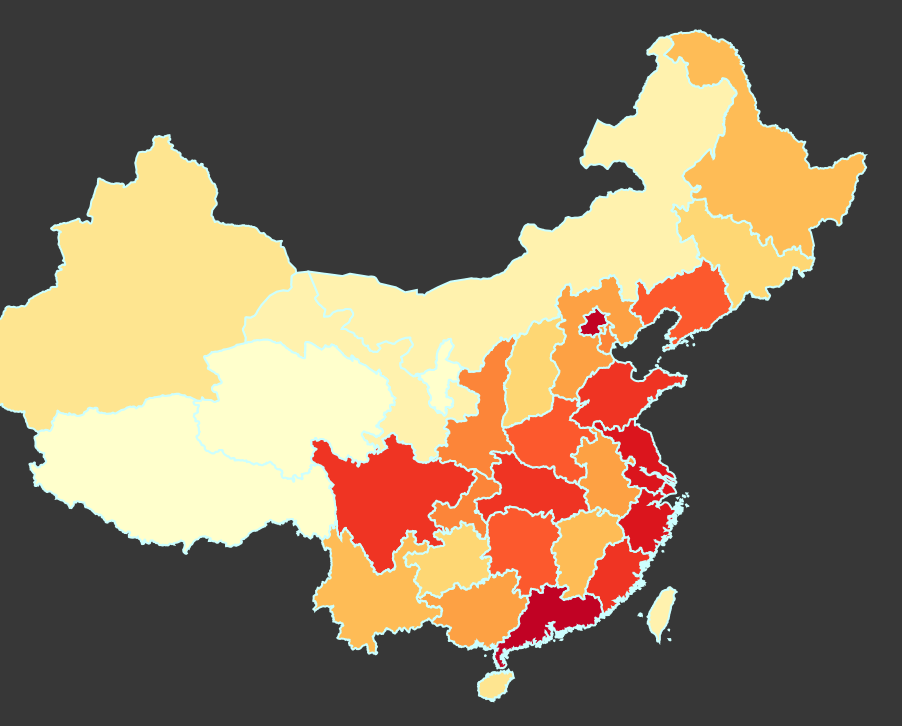
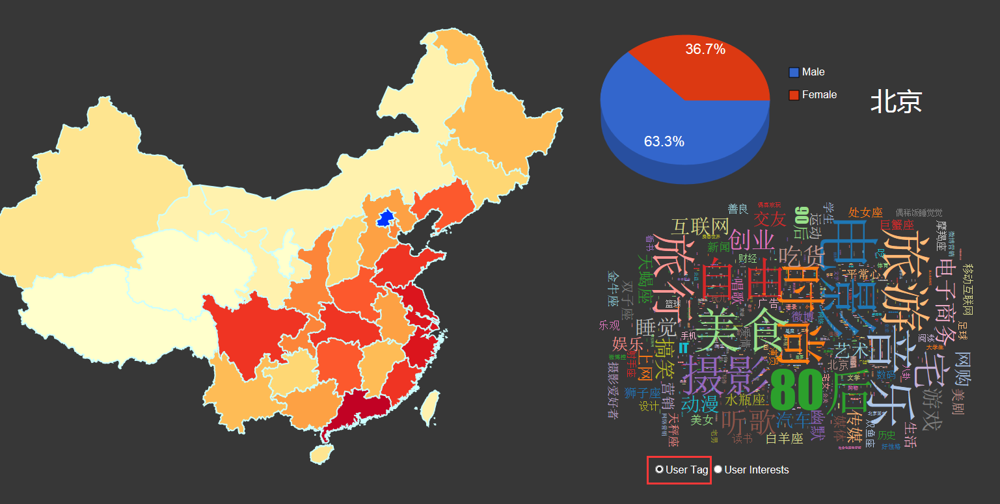
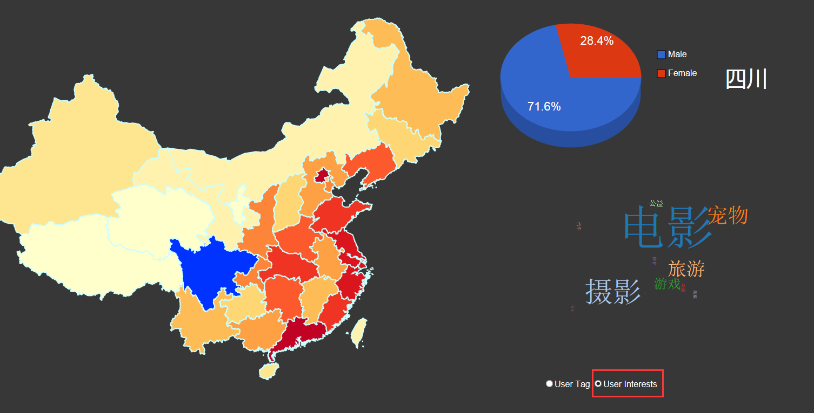

#User Data Analysis of Sina Weibo
####----Text, Spatial and Multivariate Data Visualization
##Data Source
The data comes from users of whom fans over 2000, including user ID, username, sex, area, user tags, interests, following numbers, fans numbers and weibo numbers with more than **150 thousand** pieces. To some extent, the data should be capable of reflecting holistic conditions of China since the users collected are active and influential people. We process the data into province level to find out some interesting cases like how much difference the people in different provinces are interested in, whether there is positive correlation between activeness in weibo and region’s economic development level, if females surf the Internet more than males, etc.

[StatisticWeiboNumAndSexProp.cpp](/data_process/StatisticWeiboNumAndSexProp.cpp) collects the number of weibo in various provinces and sex ratios. [InterestsOrTagsToJson.cpp](/data_process/InterestsOrTagsToJson.cpp) collects tags or interests of users. Both programs output to JSON format and thus convenient for reading. [china.json](js/china.json) generates map of China. Raw data of weibo is accessible at [Google Docs](https://docs.google.com/spreadsheets/d/1ab41DNrVZ8KDB1EQtCm65hQEUA7qfE4ZFc6lvPqFdn0/edit?usp=sharing).

##Description

Figure 1 shows the map of China with provinces colored from light yellow to dark red representing liveness of users, which is quantized with the number of weibo users published. Approximately, the activeness in weibo is basically proportional to the region’s economic development except few provinces like Taiwan considering the number of users are relatively less.

Figure 2 and Figure 3 shows overall effect of our visualization. When a province is selected, the top right corner shows province name and its male to female radio of users. Meanwhile, the bottom right corner shows a wordle revealing users’ interests or tags. The larger font size means the much more in common of interests or tags.

We are surprised to find that males have much more users than whom of females, which breaks traditional concept that females get more involved in social networks. The reason might be that females prefer offline activities like shopping or spend spare time on house works.  : )

Besides, people all over the country are interested in food, photography, travel, movies and pets! It appears that we are really good at enjoying life and barely caring about reading or politics. Actually, user tags are able to reflect more about what kind of people themselves. For example, people in sparsely-populated area tag themselves with freedom, people in tourism provinces like Hainan, Taiwan and Xizang tag with travel. Furthermore, users in the southeast are more post-90s generation while in the north are more post-80s generation. Beyond that, people tend to tag themselves with constellation. The Aquarius are almost everywhere and there are more Virgo in Anhui.

**Ps:** webpage is tested in screen resolution 1600*900 and user tags may be slightly slow to show up due to huge data size.
